<!-- Generated by GitHub Profile Agent Console. Edit profile.config.json, then run npm run generate. -->

  <picture>
    <source media="(max-width: 760px) and (prefers-color-scheme: dark)" srcset="./assets/hero/agent-console-c2ac8ee5-mobile-dark.svg">
    <source media="(max-width: 760px)" srcset="./assets/hero/agent-console-c2ac8ee5-mobile-light.svg">
    <source media="(prefers-color-scheme: dark)" srcset="./assets/hero/agent-console-c2ac8ee5-dark.svg">
    <source media="(prefers-color-scheme: light)" srcset="./assets/hero/agent-console-c2ac8ee5-light.svg">
    
  </picture>

  

