<!-- Generated by GitHub Profile Agent Console. Edit profile.config.json, then run npm run generate. -->

  <picture>
    <source media="(max-width: 760px) and (prefers-color-scheme: dark)" srcset="./assets/hero/agent-console-8f8deb20-mobile-dark.svg">
    <source media="(max-width: 760px)" srcset="./assets/hero/agent-console-8f8deb20-mobile-light.svg">
    <source media="(prefers-color-scheme: dark)" srcset="./assets/hero/agent-console-8f8deb20-dark.svg">
    <source media="(prefers-color-scheme: light)" srcset="./assets/hero/agent-console-8f8deb20-light.svg">
    
    <source media="(max-width: 760px) and (prefers-color-scheme: dark)" srcset="./assets/hero/agent-console-c2ac8ee5-mobile-dark.svg">
    <source media="(max-width: 760px)" srcset="./assets/hero/agent-console-c2ac8ee5-mobile-light.svg">
    <source media="(prefers-color-scheme: dark)" srcset="./assets/hero/agent-console-c2ac8ee5-dark.svg">
    <source media="(prefers-color-scheme: light)" srcset="./assets/hero/agent-console-c2ac8ee5-light.svg">
    
  </picture>

@@ -15,41 +15,40 @@

## About Me

I build practical systems at the intersection of artificial intelligence, software engineering, and products people can trust.
As a CSIE student at NDU, I build practical systems at the intersection of cybersecurity, artificial intelligence, and reliable software.

My work combines technical exploration with a builder mindset: understand the problem, test the system, and share what actually works.
My work combines cyber defense research with a builder mindset: analyze vulnerabilities, secure the system, and deploy what actually works.

## Current Focus

| Area | What I am exploring |
| --- | --- |
| **AI Agents** | Autonomous workflows, tool use, evaluation, and reliable agent behavior. |
| **Applied AI** | Turning model capabilities into useful and testable software systems. |
| **Developer Tools** | Better workflows for building, testing, and operating modern software. |
| **Cybersecurity** | Monitoring network protocols, deploying EDR tools, configuring firewalls, and establishing active defense workflows. |
| **Applied AI** | Integrating machine learning classifiers (like Random Forest and Logistic Regression) into lightweight, practical detection systems. |
| **Web Development** | Designing interactive digital platforms, database connections, and full-stack utilities tailored for operational training. |

## Featured Work

| Project | Focus | Why it matters |
| --- | --- | --- |
| [**Project One**](https://github.com/Wangbobo0226/project-one) | Primary project focus | A concise explanation of what the project does and why it matters. |
| [**Project Two**](https://github.com/Wangbobo0226/project-two) | Secondary project focus | A second project that supports the professional direction of this profile. |

## Research Direction

I am interested in systems that can observe state, use tools, evaluate outcomes, and take bounded actions with clear evidence and human oversight.
I am interested in building observable security systems that monitor network states, execute targeted defense playbooks, and provide clear threat evidence under human-in-the-loop oversight.

## Tech Stack

`TypeScript` · `Next.js` · `Python` · `PostgreSQL` · `Playwright`

## Recent Activity

<!-- AUTO:ACTIVITY:START -->
_Recent public activity will appear here after the workflow runs._
<!-- AUTO:ACTIVITY:END -->

---

  Building thoughtful systems and sharing what works.

